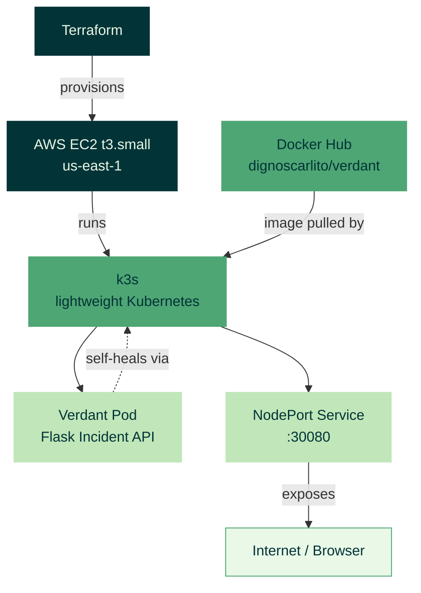

# Verdant

A real, self-hosted Kubernetes deployment — not a demo app. Verdant provisions its own cloud infrastructure with Terraform, runs a lightweight production-grade Kubernetes distribution (k3s), and deploys a containerized Incident Logger API onto it using real Kubernetes manifests.

This project exists to prove hands-on Cloud Engineering skill: infrastructure-as-code, container orchestration, self-healing systems, and cost-conscious cloud operations — not to showcase a UI.

---

## Architecture



**Flow:** Terraform provisions a single EC2 instance → k3s is installed directly on it (no managed control plane, so no hidden costs) → the Verdant container image, built and pushed to Docker Hub, is pulled and run as a Kubernetes Deployment → a NodePort Service exposes it to the internet.

---

## Tech Stack

| Layer | Tool |
|---|---|
| Infrastructure provisioning | Terraform |
| Compute | AWS EC2 (t3.small) |
| Orchestration | k3s (lightweight Kubernetes) |
| Containerization | Docker |
| Application | Python (Flask) |
| Registry | Docker Hub |

---

## The App: Incident Logger API

A minimal REST API with three endpoints:

- `GET /health` — health check (also used by Kubernetes' liveness probe)
- `POST /incidents` — log a new incident
- `GET /incidents` — list all logged incidents

Simple by design — the point of this project is the infrastructure around it, not the app itself.

---

## Engineering Depth: What This Project Actually Proves

### Self-healing
The running pod was manually deleted (`kubectl delete pod`) to simulate a crash. Kubernetes detected the failure and automatically scheduled a replacement pod, which reached `Running` status within ~1 second — with zero manual intervention.

### Horizontal scaling
The deployment was scaled from 1 replica to 3 (`kubectl scale --replicas=3`); all three pods reached `Running` within seconds, then scaled back down to 1 — demonstrating the cluster can handle increased load on demand.

### Infrastructure-as-Code discipline
The entire VM and its networking (security groups, firewall rules) are defined in Terraform, not clicked together manually. Resizing the instance (t3.micro → t3.small, after diagnosing a memory bottleneck) was a one-line config change and a `terraform apply` — no manual AWS console work.

### Cost-consciousness
Built entirely to stay within AWS's free-tier credit window, using the smallest viable instance size, no managed load balancer, and no reserved static IP — with `terraform destroy` used to tear everything down when not actively in use.

---

## Proof of Work

Screenshots/output from actually running these tests — because claims are cheap, terminal output isn't.

### Self-healing in action
The pod was deleted manually to simulate a crash, and Kubernetes replaced it automatically:

```
verdant-68c5cd6bc6-lchnp   1/1     Terminating   0          9m16s
verdant-68c5cd6bc6-6nw5r   0/1     Pending       0          0s
verdant-68c5cd6bc6-6nw5r   0/1     ContainerCreating   0          1s
verdant-68c5cd6bc6-6nw5r   1/1     Running             0          1s
```

<!-- Replace this line with:  -->

### Horizontal scaling in action
Scaled from 1 replica to 3, all reaching `Running` within seconds:

```
NAME                       READY   STATUS    RESTARTS   AGE
verdant-68c5cd6bc6-24tdl   1/1     Running   0          7s
verdant-68c5cd6bc6-6nw5r   1/1     Running   0          4m55s
verdant-68c5cd6bc6-bg2zm   1/1     Running   0          7s
```

<!-- Replace this line with:  -->

### Live health check response
```json
{"status": "ok"}
```
Returned from the deployed app at `http://<instance-ip>:30080/health`, confirming the full pipeline — Terraform → k3s → Docker → Kubernetes Service — actually works end to end.

<!-- Replace this line with:  -->

---

## Running It Yourself

```bash
# Provision infrastructure
terraform init
terraform apply

# SSH into the VM, then:
curl -sfL https://get.k3s.io | sh -

# Deploy the app
kubectl apply -f deployment.yaml
kubectl apply -f service.yaml
```

## Tearing It Down

```bash
terraform destroy
```

This removes all provisioned AWS resources, ensuring no ongoing cost.

---

## What I Learned

- Diagnosing real infrastructure failures (SSH hangs, memory exhaustion) rather than following a script that always works
- The operational difference between "it's running" and "it's healthy" — and why liveness probes and self-healing matter
- Resource planning for constrained environments (why a 1GB VM isn't enough for a full container + orchestration stack)
- Cost-safety practices: budget alerts, ephemeral IPs, and infrastructure teardown as a first-class step, not an afterthought
